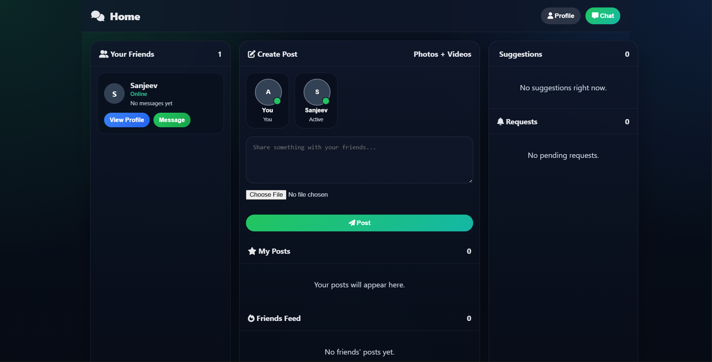
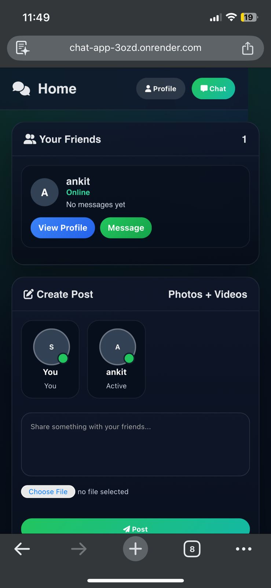

# 💬 Real-Time Chat Application

A modern, real-time chat application built with **Node.js**, **Express**, and **Socket.io**. Connect with friends, send messages, and share posts instantly!

---

## ✨ Features

- **Instant Messaging** - Send and receive messages in real-time
- **User Authentication** - Secure login with password encryption (bcrypt)
- **Connection Requests** - Send and accept connection requests from other users
- **Online Presence** - See who's online in real-time
- **Unread Messages** - Keep track of unread messages from each friend
- **User Avatars** - Upload and display profile pictures
- **Posts/Feed** - Share posts with your connections
- **Message History** - All messages are saved in database
- **Mark as Read** - Track which messages you've read
- **Responsive Design** - Works on desktop and mobile devices

---

## 📸 Screenshots

### Desktop Chat Interface



### Mobile Responsive View



## 🚀 Quick Start

### Prerequisites

Before you begin, make sure you have installed:

- **Node.js** (v14 or higher) - [Download here](https://nodejs.org/)
- **MongoDB** - [Download here](https://www.mongodb.com/try/download/community) or use MongoDB Atlas (cloud)
- **npm** or **yarn** - Usually comes with Node.js

### Installation Steps

1. **Clone or download the project**

   ```bash
   cd "real time chat"
   ```

2. **Install dependencies**

   ```bash
   npm install
   ```

   This will install all required packages from `package.json`

3. **Set up environment variables**

   Create a `.env` file in the root directory (copy from `.env.example` if available):

   ```
   PORT=3000
   MONGODB_URI=mongodb://127.0.0.1:27017/realtime_chat
   BCRYPT_ROUNDS=12
   ALLOW_LOCAL_MONGODB_FALLBACK=true
   ALLOW_IN_MEMORY_MONGODB_FALLBACK=true
   ```

4. **Start the server**

   ```bash
   npm start
   ```

   The server will run on `http://localhost:3000`

5. **Open in browser**
   - Navigate to `http://localhost:3000` in your web browser
   - Create an account or login
   - Start chatting! 🎉

---

## 📂 Project Structure

```
real-time-chat/
├── node.js                 # Main server file (backend)
├── package.json            # Project dependencies and scripts
├── .env                    # Environment variables (don't commit!)
├── .env.example            # Example environment variables
├── .gitignore              # Git ignore rules
├── public/                 # Frontend files (HTML, CSS, JavaScript)
│   ├── index.html          # Landing/Home page
│   ├── home.html           # Main dashboard page
│   ├── chat.html           # Chat interface page
│   └── style.css           # All styling
└── node_modules/           # Installed packages (not in GitHub)
```

---

## 💻 Technologies Used

| Technology    | Purpose                                  |
| ------------- | ---------------------------------------- |
| **Node.js**   | JavaScript runtime for server            |
| **Express**   | Web framework for routing                |
| **Socket.io** | Real-time communication                  |
| **MongoDB**   | Database to store users, messages, posts |
| **Mongoose**  | Database schema and queries              |
| **bcryptjs**  | Password encryption                      |
| **dotenv**    | Environment variables management         |
| **CORS**      | Cross-origin requests                    |
| **Axios**     | HTTP client (for API calls)              |

---

## 🔐 Important: .gitignore Setup

Your `.gitignore` file is already configured to prevent sensitive files from being uploaded to GitHub:

**Files that WON'T be uploaded to GitHub:**

- ❌ `node_modules/` - Too large, others can run `npm install`
- ❌ `.env` - Contains API keys and secrets
- ❌ `debug.log` - Temporary debug files
- ❌ IDE settings and OS files

**When you push to GitHub:**

```bash
git add .
git commit -m "Your message"
git push origin main
```

The listed files will automatically be ignored! ✅

---

## 📝 Available Scripts

Run these commands in the terminal:

```bash
# Start the server
npm start

# This runs the command in package.json: node node.js
```

---

## 🔌 How It Works

### Backend (node.js)

1. User logs in or registers
2. Express server handles HTTP requests
3. Socket.io creates real-time connection
4. MongoDB stores user data, messages, and posts
5. Server broadcasts events to all connected clients

### Frontend (HTML/CSS/JavaScript)

1. User interface in `public/` folder
2. JavaScript communicates with server via Socket.io
3. Messages appear instantly for both users
4. CSS provides beautiful, responsive design

---

## 🛠️ Database Structure

- **Users** – Stores user accounts, profile pictures, and login details
- **Connections** – Manages friend requests and user connections
- **Messages** – Stores chat messages and read status between users
- **Posts** – Handles user posts, media sharing, likes, and interactions

## ⚙️ Environment Variables

- `PORT` – Server running port
- `MONGODB_URI` – MongoDB database connection
- `BCRYPT_ROUNDS` – Password encryption level
- `ALLOW_LOCAL_MONGODB_FALLBACK` – Uses local database if remote DB fails

---

## 🐛 Troubleshooting

### Server Not Starting?

```bash
npm install
npm start
```

---

## 🚀 Deployment

To deploy on platforms like Render, Vercel, or Heroku:

1. Push code to GitHub (with .gitignore properly set)
2. Connect your GitHub repo to deployment platform
3. Add environment variables on the platform
4. Platform will run `npm start` automatically
5. Your app will be live! 🌍

---

## License

This project is open source and available under the ISC License.

---

## 🚧 Ongoing Improvements

This project is actively being improved with a focus on performance optimization, better real-time communication, enhanced UI/UX, and additional features to make the platform more stable and scalable.

Planned improvements include:

- Enhanced real-time messaging
- Better responsive experience
- Performance optimization
- Improved user authentication
- Additional chat and social features
